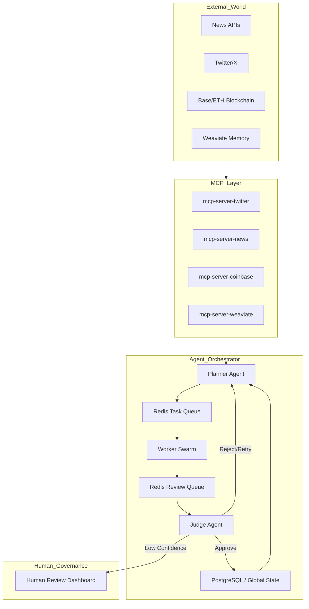

```md
# Project Chimera — Agentic Infrastructure to Builds Autonomous Influencers Agent.  

> **Role:** Forward Deployed Engineer (FDE)  
> **Mission:** Architect a “Factory” that builds Autonomous Influencers  
> **Core Method:** Spec-Driven Development (SDD) + Governance + TDD  
> **Runtime Concepts:** FastRender Swarm (Planner/Worker/Judge), MCP integration, HITL safety, Agentic Commerce

This repository is the **governed engineering foundation** for Project Chimera.  
You are **not** submitting a finished influencer product; you are submitting a **context-engineered, spec-first, test-governed codebase** that a swarm of AI agents (and humans) can extend safely.

---

## Table of Contents
- [Challenge Summary](#challenge-summary)
- [What’s Delivered](#whats-delivered)
- [Architecture Overview](#architecture-overview)
- [How to Run (Local)](#how-to-run-local)
- [TDD Proof (Failing Tests)](#tdd-proof-failing-tests)
- [Governance & Spec Alignment](#governance--spec-alignment)
- [IDE Agent Context Demo](#ide-agent-context-demo)
- [CI/CD](#cicd)
- [Directory Structure](#directory-structure)
- [Notes / Assumptions](#notes--assumptions)

---

## Challenge Summary

The primary risk in agentic systems is **ambiguity**: vague prompts, unstable code patterns, and weak governance.  
This repo addresses that by enforcing:

- **Spec-Driven Development:** Implementation must be derived from `specs/`
- **Traceability:** Every feature maps to a spec and is test-verified
- **MCP Exclusivity:** No direct external API calls from core logic
- **Swarm Architecture:** Planner → Worker → Judge pattern with safety gates
- **Human-in-the-Loop:** Confidence + sensitivity routes tasks to review
- **Enterprise-Grade Additions (“Beyond SRS”):**
  - FinOps budget controls and kill-switch concepts
  - Audit trails for tool calls and decisions
  - OpenTelemetry fields (`correlation_id`, `tenant_id`, `agent_id`)
  - “Supreme Court” multi-model consensus for high-risk commerce

---

## What’s Delivered

### Day 1 Deliverables (Specs + Architecture)
- **Executable specs** in `specs/`:
  - `_meta.md` — vision, constraints, directives
  - `functional.md` — user stories and behaviors
  - `technical.md` — JSON schemas, governance rules, ERD
  - `openclaw_integration.md` — bonus spec for agent social networking
- **Architecture strategy** (domain architecture + diagrams) in `research/architecture_strategy.md`

### Day 2 Deliverables (Context + Tooling + TDD + Governance)
- **Context Engineering rules**: `.cursor/rules` and/or `CLAUDE.md`
- **Tooling/skills strategy**: `research/tooling_strategy.md`
- **Runtime skill contracts**: `skills/*`
- **Failing JUnit 5 tests** (TDD “red” stage): `src/test/...`
- **Automation**: `Makefile`
- **CI/CD**: `.github/workflows/main.yml`
- **AI review policy**: `.coderabbit.yaml`
- **Bonus**:
  - `Dockerfile` + `make docker-test`
  - `scripts/spec-check.sh` + `make spec-check`

---

## Architecture Overview

### High-Level Pattern: FastRender Swarm + MCP

- **Planner:** decomposes high-level goals into tasks
- **Worker:** executes atomic tasks (stateless) using MCP tools
- **Judge:** validates outputs, routes HITL, commits state using OCC
- **HITL:** humans approve medium confidence or sensitive content
- **CFO Judge (Beyond SRS):** financial safety gate for commerce actions

### Diagram

> The architecture diagram is defined in Mermaid inside:
- `research/architecture_strategy.md`

You can render Mermaid directly in GitHub Markdown.

Example view:



---

## How to Run (Local)

### Prerequisites
- Java **21+**
- Maven **3.9+**
- (Optional) Docker

### Verify Java & Maven
```bash
java -version
mvn -v
```

### Setup dependencies
```bash
make setup
# or
mvn clean install -DskipTests
```

---

## TDD Proof (Failing Tests)

This repository intentionally includes **failing tests** to prove true TDD:
- tests define the “empty slot”
- implementation is expected to be filled in later by agents/humans
- CI executes these tests on push (governance gate)

Run:
```bash
make test
# or
mvn test
```

Expected: **tests fail** deterministically (red stage).

---

## Governance & Spec Alignment

### Spec-check (bonus governance)
This script verifies:
- required specs exist
- rules file contains required directives
- technical schema anchors exist
- no direct HTTP clients in core code (MCP exclusivity guard)

Run:
```bash
make spec-check
# or
bash scripts/spec-check.sh
```

### AI Review Policy
- `.coderabbit.yaml` instructs AI reviewer to verify:
  - spec alignment (`specs/`)
  - Java thread safety (records, immutability)
  - security (no secrets, no direct HTTP)
  - reliability and observability

---

## IDE Agent Context Demo

For Loom video, demonstrate that your IDE agent follows the repo rules.

1) Open `CLAUDE.md` or `.cursor/rules` and highlight:
- `NEVER generate code without checking specs/ first.`
- `Explain your plan before writing code.`

2) In IDE chat, ask:

> “I want to implement AgentTask and WorkerResult. Before writing any code, check specs/technical.md and summarize the required fields and constraints. Then provide a plan. Do not write implementation code yet.”

A correct response should:
- cite `specs/technical.md`
- provide a plan before code
- mention Java 21 Records, OCC (`state_version`), MCP-only boundary, and observability fields

---

## CI/CD

GitHub Actions workflow:
- runs on `push` and `pull_request`
- uses Java 21
- runs `make setup` then `make test`

Path:
- `.github/workflows/main.yml`

---

## Directory Structure

```txt
.cursor/
  rules
.github/
  workflows/
    main.yml
research/
  architecture_strategy.md
  tooling_strategy.md
scripts/
  spec-check.sh
skills/
  skill_trend_fetcher/
  skill_publish_social_post/
specs/
  _meta.md
  functional.md
  technical.md
  openclaw_integration.md
src/
  main/
  test/
Dockerfile
Makefile
pom.xml
.coderabbit.yaml
CLAUDE.md
```

---

## Notes / Assumptions

- External APIs are accessed only through MCP servers (social, memory, commerce, media).
- Redis is used for high-speed queues and episodic cache in the architecture.
- PostgreSQL is the authority for committed global state (OCC) and audit/ledger metadata.
- This repo is a **governed scaffold** rather than a production deployment.

---

## License
See `LICENSE`.
```