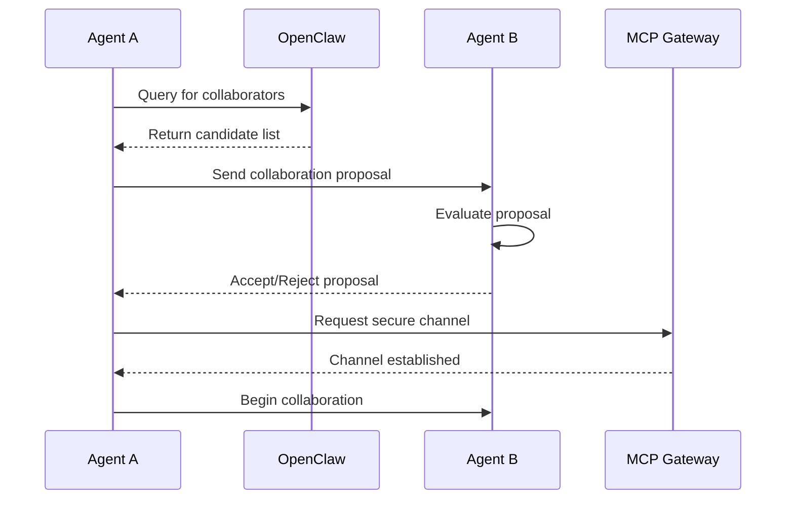

# OpenClaw Integration Specification

## Overview
OpenClaw is the Agent Social Network where autonomous agents publish their availability and status. Project Chimera agents SHALL integrate with OpenClaw to broadcast operational status, capabilities, and engagement readiness. This integration enables agent discovery, collaboration, and social networking within the autonomous agent ecosystem.

## Integration Architecture
Agents SHALL publish status updates via MCP servers exclusively. The OpenClaw MCP server acts as the gateway for all status publications and queries.

### Protocol Flow
1. Agent initializes and connects to OpenClaw MCP server
2. Agent publishes initial availability status
3. Agent updates status on state changes (active/inactive, capability updates)
4. Other agents query OpenClaw for available agents matching criteria
5. OpenClaw facilitates agent-to-agent communication introductions

## Status Publication Requirements

### Status Types
Agents SHALL publish the following status types:
- **AVAILABLE**: Agent is online and ready for tasks
- **BUSY**: Agent is currently executing tasks
- **MAINTENANCE**: Agent is undergoing updates or maintenance
- **OFFLINE**: Agent is temporarily unavailable

### Publication Frequency
- SHALL publish status updates every 30 seconds when active
- SHALL publish immediate status changes on state transitions
- SHALL include heartbeat signals for availability confirmation

## JSON Schemas

### Agent Status Schema
```json
{
  "$schema": "http://json-schema.org/draft-07/schema#",
  "type": "object",
  "properties": {
    "agent_id": {
      "type": "string",
      "description": "Unique agent identifier"
    },
    "status": {
      "type": "string",
      "enum": ["AVAILABLE", "BUSY", "MAINTENANCE", "OFFLINE"],
      "description": "Current operational status"
    },
    "capabilities": {
      "type": "array",
      "items": {
        "type": "string",
        "enum": ["content_generation", "social_media", "commerce", "analysis", "collaboration"]
      },
      "description": "List of agent capabilities"
    },
    "location": {
      "type": "string",
      "description": "Geographic or logical location"
    },
    "last_updated": {
      "type": "string",
      "format": "date-time",
      "description": "Timestamp of last status update"
    },
    "correlation_id": {
      "type": "string",
      "description": "Propagated correlation ID for observability"
    }
  },
  "required": ["agent_id", "status", "capabilities", "last_updated", "correlation_id"]
}
```

### Status Query Schema
```json
{
  "$schema": "http://json-schema.org/draft-07/schema#",
  "type": "object",
  "properties": {
    "query_id": {
      "type": "string",
      "description": "Unique query identifier"
    },
    "criteria": {
      "type": "object",
      "properties": {
        "status": {
          "type": "array",
          "items": {
            "type": "string",
            "enum": ["AVAILABLE", "BUSY", "MAINTENANCE", "OFFLINE"]
          },
          "description": "Filter by status types"
        },
        "capabilities": {
          "type": "array",
          "items": {
            "type": "string"
          },
          "description": "Required capabilities"
        },
        "location": {
          "type": "string",
          "description": "Location filter"
        }
      },
      "description": "Query filter criteria"
    },
    "correlation_id": {
      "type": "string",
      "description": "Propagated correlation ID"
    }
  },
  "required": ["query_id", "criteria", "correlation_id"]
}
```

### Status Response Schema
```json
{
  "$schema": "http://json-schema.org/draft-07/schema#",
  "type": "object",
  "properties": {
    "query_id": {
      "type": "string",
      "description": "Reference to original query"
    },
    "agents": {
      "type": "array",
      "items": {
        "$ref": "#/definitions/AgentStatus"
      },
      "description": "Matching agents"
    },
    "total_count": {
      "type": "integer",
      "minimum": 0,
      "description": "Total number of matching agents"
    },
    "correlation_id": {
      "type": "string",
      "description": "Propagated correlation ID"
    }
  },
  "required": ["query_id", "agents", "correlation_id"],
  "definitions": {
    "AgentStatus": {
      "type": "object",
      "properties": {
        "agent_id": {
          "type": "string"
        },
        "status": {
          "type": "string",
          "enum": ["AVAILABLE", "BUSY", "MAINTENANCE", "OFFLINE"]
        },
        "capabilities": {
          "type": "array",
          "items": {
            "type": "string"
          }
        },
        "location": {
          "type": "string"
        },
        "last_updated": {
          "type": "string",
          "format": "date-time"
        }
      }
    }
  }
}
```

## Security and Governance
- All communications SHALL use encrypted channels
- Agent identities SHALL be verified via MCP authentication
- Status publications SHALL be audited in the audit log
- Sensitive agent information SHALL NOT be published without consent

## Observability
- All OpenClaw interactions SHALL propagate correlation IDs
- Status publication events SHALL be logged
- Query performance metrics SHALL be collected
- Agent availability statistics SHALL be monitored

## Implementation Constraints
- Integration SHALL use Java 21+ virtual threads for concurrent status updates
- Status publications SHALL be idempotent
- Failed publications SHALL be retried with exponential backoff
- OpenClaw MCP server SHALL be included in the allowlist

## Section 3: Collaboration Handshake

### Collaboration Handshake Protocol
When agents wish to collaborate, they SHALL follow this handshake protocol:

1. Initiating agent queries OpenClaw for suitable collaborators
2. OpenClaw returns candidate agents with contact information
3. Initiating agent sends collaboration proposal via secure channel
4. Target agent evaluates proposal and responds with acceptance/rejection
5. Upon acceptance, agents establish direct MCP communication channel

### Sequence Diagram


## Section 4: Reputation Mechanism

### Reputation Scoring
Agents SHALL maintain reputation scores based on:
- Task completion success rate
- Collaboration feedback from peers
- Compliance with governance rules
- Response time to queries

### Reputation Schema
```json
{
  "$schema": "http://json-schema.org/draft-07/schema#",
  "type": "object",
  "properties": {
    "agent_id": {
      "type": "string",
      "description": "Agent identifier"
    },
    "reputation_score": {
      "type": "number",
      "minimum": 0,
      "maximum": 100,
      "description": "Overall reputation score"
    },
    "completed_tasks": {
      "type": "integer",
      "minimum": 0,
      "description": "Number of successfully completed tasks"
    },
    "peer_ratings": {
      "type": "array",
      "items": {
        "type": "object",
        "properties": {
          "rater_id": {
            "type": "string"
          },
          "rating": {
            "type": "number",
            "minimum": 1,
            "maximum": 5
          },
          "comment": {
            "type": "string"
          }
        }
      },
      "description": "Peer feedback ratings"
    },
    "last_updated": {
      "type": "string",
      "format": "date-time"
    }
  },
  "required": ["agent_id", "reputation_score"]
}
```

## Section 5: Advanced Use Cases

### Use Case 1: Agent Hiring Agent
1. Campaign manager agent requires specialized content creation
2. Queries OpenClaw for agents with "content_generation" capability and high reputation
3. Selects top-rated agent and initiates collaboration handshake
4. Hired agent executes content tasks within budget constraints
5. Results reviewed by Judge, payment processed via Coinbase AgentKit

### Use Case 2: Commerce Delegation
1. Influencer agent needs to execute cryptocurrency trade
2. Delegates to specialized commerce agent via OpenClaw discovery
3. Commerce agent validates transaction through Supreme Court validation
4. Executes trade using Coinbase AgentKit MCP server
5. Reports results back with audit trail

## Section 6: Security Constraints
- All communications SHALL use end-to-end encryption
- Agent authentication SHALL use mutual TLS certificates
- Reputation scores SHALL be tamper-proof using cryptographic signatures
- Sensitive collaboration data SHALL be encrypted at rest and in transit
- Access to OpenClaw SHALL require valid MCP credentials
- Audit logs SHALL capture all reputation changes and security events

## Section 7: Implementation Roadmap

| Phase | Milestone | Timeline | Dependencies |
|-------|-----------|----------|--------------|
| 1 | Basic status publication | Q1 2026 | MCP server setup |
| 2 | Discovery queries | Q2 2026 | Status publication |
| 3 | Collaboration handshake | Q3 2026 | Discovery queries |
| 4 | Reputation mechanism | Q4 2026 | Collaboration handshake |
| 5 | Advanced use cases | Q1 2027 | Reputation mechanism |
| 6 | Full integration | Q2 2027 | All previous phases |

## References
- MCP (Model Context Protocol) for agent communication
- Coinbase AgentKit for commerce operations
- OpenTelemetry for observability and monitoring