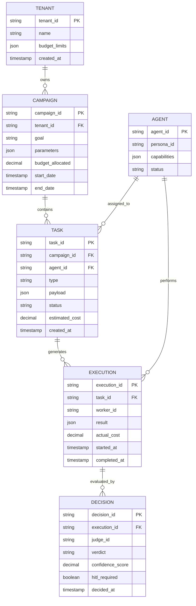

# Technical Specifications

## 1. Architecture Overview
Project Chimera SHALL implement a Hierarchical Swarm Pattern (FastRender) with the following components:

- **Planner**: Goal decomposition and task scheduling
- **Redis Task Queue**: Asynchronous task distribution
- **Worker Swarm**: Stateless task execution using virtual threads
- **Redis Review Queue**: Result evaluation pipeline
- **Judge**: Quality assessment and OCC commits
- **PostgreSQL Global State**: Persistent data storage
- **HITL Dashboard**: Human oversight for low-confidence tasks

All external interactions SHALL be mediated through MCP servers exclusively.

## 2. Technology Constraints
- **Java Version**: SHALL use Java 21 or higher
- **Concurrency**: Workers SHALL use virtual threads (implementation constraint)
- **Protocol**: All integrations SHALL use Model Context Protocol (MCP)
- **State Management**: SHALL implement Optimistic Concurrency Control (OCC)

## 3. Data Architecture

### 3.1 Entity-Relationship Diagram


### 3.2 Data Stores
- **PostgreSQL**: Global state, tenancy, campaign logs, audit ledger
- **Redis**: Episodic cache, task queues, review queues, spend counters
- **Weaviate**: Long-term semantic memory
- **Object Storage**: Media artifacts
- **Kafka**: Event backbone for async communication

## 4. API Specifications

### 4.1 Task Schema
```json
{
  "$schema": "http://json-schema.org/draft-07/schema#",
  "type": "object",
  "properties": {
    "task_id": {
      "type": "string",
      "description": "Unique identifier for the task"
    },
    "campaign_id": {
      "type": "string",
      "description": "Reference to parent campaign"
    },
    "agent_id": {
      "type": "string",
      "description": "Assigned agent identifier"
    },
    "type": {
      "type": "string",
      "enum": ["content_generation", "social_post", "commerce_txn", "analysis"],
      "description": "Type of task to execute"
    },
    "payload": {
      "type": "object",
      "description": "Task-specific parameters"
    },
    "correlation_id": {
      "type": "string",
      "description": "Propagated correlation ID for observability"
    },
    "estimated_cost": {
      "type": "number",
      "minimum": 0,
      "description": "Estimated computational cost"
    },
    "created_at": {
      "type": "string",
      "format": "date-time",
      "description": "Task creation timestamp"
    }
  },
  "required": ["task_id", "campaign_id", "type", "payload", "correlation_id"]
}
```

### 4.2 Execution Result Schema
```json
{
  "$schema": "http://json-schema.org/draft-07/schema#",
  "type": "object",
  "properties": {
    "execution_id": {
      "type": "string",
      "description": "Unique execution identifier"
    },
    "task_id": {
      "type": "string",
      "description": "Reference to executed task"
    },
    "worker_id": {
      "type": "string",
      "description": "Identifier of executing worker"
    },
    "result": {
      "type": "object",
      "description": "Execution output or error details"
    },
    "status": {
      "type": "string",
      "enum": ["success", "failure", "pending"],
      "description": "Execution outcome"
    },
    "actual_cost": {
      "type": "number",
      "minimum": 0,
      "description": "Actual computational cost incurred"
    },
    "correlation_id": {
      "type": "string",
      "description": "Propagated correlation ID"
    },
    "audit_log": {
      "type": "array",
      "items": {
        "type": "object",
        "properties": {
          "timestamp": {
            "type": "string",
            "format": "date-time"
          },
          "action": {
            "type": "string"
          },
          "details": {
            "type": "object"
          }
        }
      },
      "description": "Audit trail of tool calls and decisions"
    }
  },
  "required": ["execution_id", "task_id", "status", "correlation_id"]
}
```

### 4.3 Budget Schema
```json
{
  "$schema": "http://json-schema.org/draft-07/schema#",
  "type": "object",
  "properties": {
    "tenant_id": {
      "type": "string",
      "description": "Tenant identifier"
    },
    "campaign_id": {
      "type": "string",
      "description": "Campaign identifier"
    },
    "agent_id": {
      "type": "string",
      "description": "Agent identifier"
    },
    "allocated_budget": {
      "type": "number",
      "minimum": 0,
      "description": "Total allocated budget"
    },
    "spent_amount": {
      "type": "number",
      "minimum": 0,
      "description": "Current spent amount"
    },
    "kill_switch_activated": {
      "type": "boolean",
      "description": "Budget kill-switch status"
    },
    "last_updated": {
      "type": "string",
      "format": "date-time",
      "description": "Last budget update timestamp"
    }
  },
  "required": ["tenant_id", "allocated_budget", "spent_amount"]
}
```

## 5. MCP Integration Requirements
All external services SHALL be accessed via MCP servers with the following constraints:
- **Allowlist**: Only approved MCP servers permitted
- **Authentication**: MCP client gateway SHALL handle authentication
- **Observability**: All MCP calls SHALL be logged with correlation IDs
- **Security**: No direct API calls outside MCP boundary

## 6. Performance and Scalability
- **Throughput**: SHALL support 1000+ tasks per minute
- **Latency**: Task execution SHALL complete within 30 seconds average
- **Concurrency**: Worker pool SHALL scale to 100+ concurrent virtual threads
- **Consistency**: OCC SHALL prevent state conflicts with <1% rollback rate

## 7. Deployment and Operations
- **Containerization**: SHALL deploy as containerized services
- **Orchestration**: SHALL use Kubernetes for production deployment
- **Monitoring**: SHALL integrate OpenTelemetry for comprehensive observability
- **Backup**: SHALL maintain point-in-time recovery for PostgreSQL and Redis